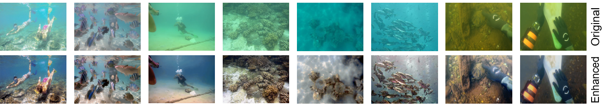

# Underwater Image Enhancement Toolbox

This is an open source underwater image enhancement toolbox based on PyTorch. Meanwhile, this is the code of the implementation of the [UIEC^2-Net](http://arxiv.org/abs/2103.07138). If you use our code, please consider citing our paper. Thanks.



Documentation: https://uwenhancement.readthedocs.io/

## Introduction

This is a code that summarizes deep learning-based underwater image enhancement. We converted relevant **<font color=#dd0000 >Tensorflow</font>** code to  **<font color=#dd0000 >PyTorch</font>**, and transcoded the Tensorflow checkpoint provided by the author so that it can be read by PyTorch. We confirmed the reliability of transcoding, and uploaded the PyTorch checkpoint models(.pth file) to **<font color=#00C >Google Drive</font>** and **<font color=#00C >Baidu Cloud</font>**. (You can download at [Model Zoo](./docs/model_zoo.md))

This is convenient for everyone to use the same environment to run experiments. We currently support [UIEC^2-Net](https://github.com/BIGWangYuDong/UWEnhancement), [UWCNN](https://github.com/saeed-anwar/UWCNN), [WaterNet](https://github.com/Li-Chongyi/Water-Net_Code), and we will continue to update. (More details in [Model Zoo](./docs/model_zoo.md))

### Highlights

- TTA x8 (Test Time Argument x8 images)

- fp16
- Visualize Network Structure
- Training process monitoring (Use Visdom package)
- Training log records, and loss visualize(Use TensorboardX package)
- Tensorflow to PyTorch.
- ...

You can get more details at [useful_tools](./docs/useful_tools.md).

**TODO:**

- We will support GAN soon.
- In the future we will support PIxel-Level related tasks, such as Dehazing, Salient Object Detection(SOD) etc. 

## Installation

Please refer [getting_start.md](./docs/getting_start.md) for installation.

## Prepare Data

Using [write_txt.py](./tools/write_txt.py) prepare train.txt and test.txt. All datasets should put in DATA folders, the directory structure is:

    .
    ├── ...
    ├── DATA
    │   ├── Train
    │   │   ├── train
    │   │   ├── gt
    │   │   └── train.txt
    │   ├── Test
    │   │   ├── test
    │   │   ├── gt(if need)
    │   │   └── test.txt
    └── ...
If you want to run WaterNet, you should [prepare GC, WB, HE images](./tools/get_waternet_data) and put in ```DATA/Train/WaterNet``` and ```DATA/Train/WaterNet```, the directory structure is:

    .
    ├── WaterNet
    │    ├── ce
    │    ├── gc
    │    └── wb


## Prepare Training and Testing

1. Clone the repo.
    ```shell
    git clone https://github.com/BIGWangYuDong/UWEnhancement.git UW
    ```
2. put the checkpoint(*.pth) in [checkpoints/](./checkpoints)
3. change args.config and args.load_from root path.
4. change config/XXX.py data root path, and some other important options.

If you want to use our toolbox to add some New Models, Data Pipelines, loss functions or some other operation,  **We provide [Tutorials](./docs/tutorials.md).**

## Testing

```
python test.py
# or 
python test_UWModels/test_XXX.py
```

## Training

```
python -m visdom.server			# open this in a single terminal
python train.py --gpus XX 		# XX means use numbers of gpus
```


## Contact Us

If you have any questions, please contact us (yudongwang@tju.edu.cn or yudongwang1226@gmail.com).

Bibliography entry for citation:

```
@article{wang2021uiec,
title = {{UIEC\^{}2-Net}: CNN-based underwater image enhancement using two color space},
journal = {Signal Processing: Image Communication},
volume = {96},
pages = {116250},
year = {2021},
issn = {0923-5965},
doi = {https://doi.org/10.1016/j.image.2021.116250},
url = {https://www.sciencedirect.com/science/article/pii/S0923596521001004},
author = {Yudong Wang and Jichang Guo and Huan Gao and Huihui Yue},
}

```


